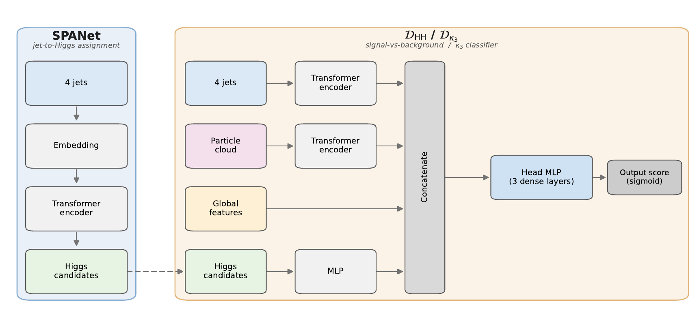

# Di-Higgs trilinear coupling (κ₃) at a multi-TeV muon collider — resolved VBF HH → bb̄bb̄

End-to-end analysis code for the di-Higgs trilinear-coupling measurement at a
**3 TeV (1 ab⁻¹)** and **10 TeV (10 ab⁻¹)** muon collider, resolved 4-jet channel
(μ⁺μ⁻ → HH νν̄ / HH μ⁺μ⁻ → bb̄bb̄ + invisible). The **same code** drives both
centre-of-mass energies — only the YAML config differs.

```
.root files  →  features h5  →  SPANet pairing  →  D_HH / D_κ3 classifiers  →  −ΔlnL(κ₃)
```

<!--
  ARXIV PLACEHOLDER — once the preprint is posted, replace 26XX.XXXXX with the
  real identifier in exactly two places: the reference just below, and the
  BibTeX entry in the "Citation" section at the end of this file.
    sed -i 's/26XX\.XXXXX/YYMM.NNNNN/g' README.md
-->

This repository accompanies

> K. Cheung, J. S. Lee, S. Lee and C. Wang,
> *Probing the trilinear Higgs self-coupling in Higgs boson pair production at
> multi-TeV muon colliders*,
> [arXiv:26XX.XXXXX](https://arxiv.org/abs/26XX.XXXXX).

The paper covers both the resolved (4-jet) and the boosted (2 fat-jet)
regions. This repository contains the **resolved-channel pipeline only**: feature
extraction (including topological-data-analysis descriptors), the SPANet-style
jet→Higgs pairing network, the two event classifiers, and the binned
likelihood scan in κ₃. The release covers the default analysis chain behind
the paper's central values; the auxiliary robustness studies quoted in the
paper (template-morphing cross-check, bootstrap MC-statistics diagnostics,
multi-seed ensembles) are simple variations of this chain and are not part of
the release.

## Pipeline at a glance

| step | script | when | output |
|---:|---|---|---|
| 01  | `01_extract_features.py` | extract if h5 missing | `data/<stage>/<input>.h5` |
| 02a | `02a_tune_spanet.py`     | `--retune-spanet` (default ON) | `models/<stage>/spanet_best.json` |
| 02  | `02_train_spanet.py`     | always | `models/<stage>/spanet.pt` + history |
| 03  | `03_precompute_pairing.py` | always | `models/<stage>/assign_<input>.npy` |
| 04a | `04a_tune_ml1.py`        | `--retune-ml` (default OFF) | `models/<stage>/ml1_best.json` |
| 04  | `04_train_ml1.py`        | always | `models/<stage>/ml1.keras` + scores |
| 05a | `05a_tune_ml2.py`        | `--retune-ml` (default OFF) | `models/<stage>/ml2_best.json` |
| 05  | `05_train_ml2.py`        | always | `models/<stage>/ml2.keras` + scores |
| 06  | `06_ml_analysis.py`      | always | `analysis/<stage>/*.png, *.npz` |
| 07  | `07_dll_scan.py`         | always | `dll/<stage>/dll_scan.npz` + `dll_per_kappa.md` |
| 08  | `08_dll_plots.py`        | always | `dll/<stage>/fig_dll_curve.png`, `fig_logSB.png` |

ML1 is the signal-vs-background classifier ($\mathcal{D}_{\rm HH}$ in the paper);
ML2 is the κ₃ shape discriminator ($\mathcal{D}_{\kappa_3}$, trained binary
κ₃ = 0.4 vs 1.6).

## Input data

The pipeline starts from Delphes-simulated `.root` samples
(MadGraph5_aMC@NLO + MadSpin + Pythia 8 + Delphes 3 with the muon-collider
detector card), generated as described in the paper: the HH signal for a grid of
κ₃ values plus the seven resolved-region SM background processes, at both 3 and
10 TeV. The samples are not distributed with this repository (≈10⁶ events per
process); they can be regenerated from the generator setup in the paper, or
requested from the authors. Every input `.root` file is listed **explicitly by
path** in `config/<stage>.yaml` — no filename parsing or auto-discovery — so the
analysis is reproducible bit-for-bit from this repo + the samples. The file
names in the `roots:` lists are examples reflecting our generation batches;
point them at your own files (the `${data_root}` prefix is substituted from
`HHML_DATA_ROOT`). The `kappa_indep` input is a second, statistically
independent generation at κ₃ ∈ {0.4, 1.0, 1.6}; it provides the κ₃ = 1
reference spectrum for the likelihood and unbiased evaluation templates at the
two κ₃ values the shape classifier was trained on.

## Environment

```bash
pip install -r requirements.txt
```

Two environment variables adapt the pipeline to your machine (nothing
user-specific is checked in):

```bash
# Conda env's runtime library dir (TensorFlow / PyTorch CUDA links).
export HHML_CONDA_LIB=/path/to/your/miniconda3/envs/<env>/lib

# Directory holding the raw Delphes .root files (referenced from config/*.yaml).
export HHML_DATA_ROOT=/path/to/your/root_files
```

If `HHML_CONDA_LIB` is unset, each GPU step prints a warning and runs with the
system library path (fine if your TF/Torch install is self-contained).
If `HHML_DATA_ROOT` is unset, step 01 fails fast with a clear
"file not found" naming the offending path.

## How to run

```bash
# FIRST run on a fresh clone: include --retune-ml, so the Optuna searches
# (04a/05a) create models/<stage>/ml{1,2}_best.json before the final trainings.
# Without it, step 04 stops with "ml1_best.json not found".
bash run_all.sh 3tev --retune-ml
bash run_all.sh 10tev --retune-ml

# Subsequent runs (best.json files already present; skip both Optuna searches)
bash run_all.sh 3tev --no-retune-spanet

# Flags (run_all.sh)
#   --skip-extract        skip step 01 (use existing h5)
#   --force-extract       re-extract even if h5 exists
#   --retune-spanet       (default ON)  run 02a Optuna before 02 final train
#   --no-retune-spanet    use existing models/<stage>/spanet_best.json
#   --retune-ml           (default OFF) run 04a/05a Optuna before 04/05 train
```

All stage-dependent physics inputs (luminosity, cross sections, background
process list) live in the `physics:` block of `config/<stage>.yaml` — edit
them there for your own MC set; nothing is hard-coded.

## Model architecture



Both classifiers (`D_HH`, `D_κ3`) share this multi-stream architecture:
jet-token self-attention, Higgs-candidate tokens built from the SPANet
pairing, global high-level + topological features, and a low-level
particle-cloud stream, merged into a single sigmoid output.

## Figures

After a full run, the paper-style figures can be reproduced with the
plotting steps (all config-driven — a different `fit_kappa_grid`, κ3
endpoints or background list propagates automatically):

| script | figure | output |
|---|---|---|
| `08_dll_plots.py` | −ΔlnL(κ₃) scan + poly4 fit + 68/95% CL bands; log₁₀(S/B) template map | `dll/<stage>/fig_dll_curve.png`, `fig_logSB.png` |
| `09_plot_kinematics.py` | kinematic distributions, κ₃ slices vs weighted background (`--split-bg`: per-process colour stack) | `analysis/<stage>/fig_kinematics.png` |
| `10_plot_scores.py` | D_HH / D_κ3 score distributions (`--split-bg`: per-process colour stack) | `analysis/<stage>/fig_scores.png` |
| `11_plot_shap.py` | SHAP beeswarm for both classifiers | `analysis/<stage>/fig_shap.png` |

`run_all.sh` stops at step 08; the remaining figures are produced directly:

```bash
for s in 09_plot_kinematics 10_plot_scores 11_plot_shap; do
    python3 src/${s}.py --config config/3tev.yaml     # and config/10tev.yaml
done
```

## Key design choices

* **Six transformed jet features** for SPANet
  (`log_pt, η, sin_φ, cos_φ, log1p(m/5), btag`) → `src/lib/jet_features.py:transform_6`.
  ML1/ML2 use a parallel layout in `ml_arch.build_jet_tokens`: the first five
  features are identical, but the 6th token slot carries `|Δφ(jet, MET)|`
  instead of `btag`, and the b-tag is fed as a separate `jet_btag` (N, 4) int
  stream so the model can learn its own embedding.

* **TDA descriptors** (`H0, H1, S0, S1, LB1`): persistent homology
  (Vietoris–Rips over the (η, φ) energy flow, chord metric
  d = √(Δη² + (2 sin(Δφ/2))²)) via `ripser`, computed in
  `src/lib/extract_engine.py`.

* **Leak-free likelihood protocol**: the κ₃ = 1 Asimov anchor is taken from an
  *independent* Monte-Carlo sample (`kappa_indep`; configurable in `dll.anchor`),
  so −ΔlnL(κ₃ = 1) is not artificially forced to 0 by self-comparison.

* **SPANet folds — what is and is not held out**: the pairing network uses an
  85/15 train/val split of `sigbg_main` and has **no test fold of its own**
  (it is an upstream feature-builder, not a quoted classifier).  The κ₃
  templates and the κ₃ = 1 anchor of the likelihood come from samples
  (`kappa_scan_*`, `kappa_indep`) SPANet never trained on, so the extracted
  intervals are unaffected.  Conversely, the events on which the `D_HH`
  score distributions are evaluated (ML1's test fold) largely overlap
  SPANet's training fold on the signal side, so the SPANet-derived inputs
  (`m_H1`, `m_H2`, `X_HH`, …) are in-sample there and the displayed
  `D_HH` separation is mildly optimistic.

* **CL extraction**: the per-κ₃ Asimov −ΔlnL scan is shifted by its κ₃ = 1
  value (a display convention; the constant shift does not change the
  intervals) and fitted with a fourth-order polynomial; the 68 % (95 %) CL
  interval is the connected region below 0.5 (1.92) **referenced to the
  fitted minimum** → `src/lib/dll.py:poly4_w68`.  The fit spans the full
  `dll.fit_kappa_grid` by default; an optional `dll.fit_window` restricts
  it to a κ₃ sub-range (points outside are still scanned and plotted).

* **Optuna with an anti-overparameterisation cap**: trials whose trainable
  parameter count violates `n_train_signal ≥ safety_factor × n_params` are
  pruned (`optuna.*.safety_factor` in the config).

## Repository layout

```
muc-hh-kappa3/
├── config/{3tev,10tev}.yaml      # all paths and hyper-parameter knobs
├── src/
│   ├── 01_extract_features.py … 08_dll_plots.py   # numbered pipeline steps
│   └── lib/                      # config_loader, data_loader, jet_features,
│                                 # extract_engine, spanet_engine, ml_arch,
│                                 # dll, weights, sample_weights, quantile,
│                                 # histograms, splits, physics_constants
├── requirements.txt
├── run_all.sh
└── README.md
```

`data/`, `models/`, `analysis/`, `dll/`, `logs/` are created at run time and
git-ignored.

## Reproducing on a fresh machine

1. clone this repository (Python ≥ 3.10)
2. `pip install -r requirements.txt`
3. arrange the `.root` samples at the paths listed in `config/<stage>.yaml` (`inputs.*.roots`)
4. `bash run_all.sh 3tev --retune-ml` ; `bash run_all.sh 10tev --retune-ml`
   (the `--retune-ml` is needed once, to generate `models/<stage>/ml{1,2}_best.json`)
5. final −ΔlnL(κ₃) plot at `dll/<stage>/fig_dll_curve.png`; per-κ₃ table at
   `dll/<stage>/dll_per_kappa.md`

The shipped `config/10tev.yaml` already restricts the polynomial fit to the
paper's `dll.fit_window: [0.8, 1.2]` (the refined grid around the likelihood
well), so the default run reproduces the paper's 10 TeV intervals; comment
the line out to fit the full scan range instead.

A note on reproducibility: given fixed trained networks, the likelihood scan
and CL extraction (steps 07 and 08) are deterministic. The network trainings themselves (steps 02, 04,
05) run on GPU and are not bit-reproducible, so a retrained pipeline lands on
statistically equivalent but not identical networks. The extracted intervals
then reproduce the paper within the training spread; repeating the full
training with five different random seeds moved the 68% CL width by about
±0.02 at 3 TeV and ±0.005 at 10 TeV.

## Citation

If you use this code, please cite the accompanying paper:

```bibtex
@article{Cheung:2026kappa3,
    author        = "Cheung, Kingman and Lee, Jae Sik and Lee, Soojin and Wang, Chen",
    title         = "{Probing the trilinear Higgs self-coupling in Higgs boson
                      pair production at multi-TeV muon colliders}",
    eprint        = "26XX.XXXXX",
    archivePrefix = "arXiv",
    primaryClass  = "hep-ph",
    year          = "2026"
}
```

The eprint number is a placeholder until the preprint is posted; the citation
key, DOI and journal reference will follow the INSPIRE-HEP entry.
